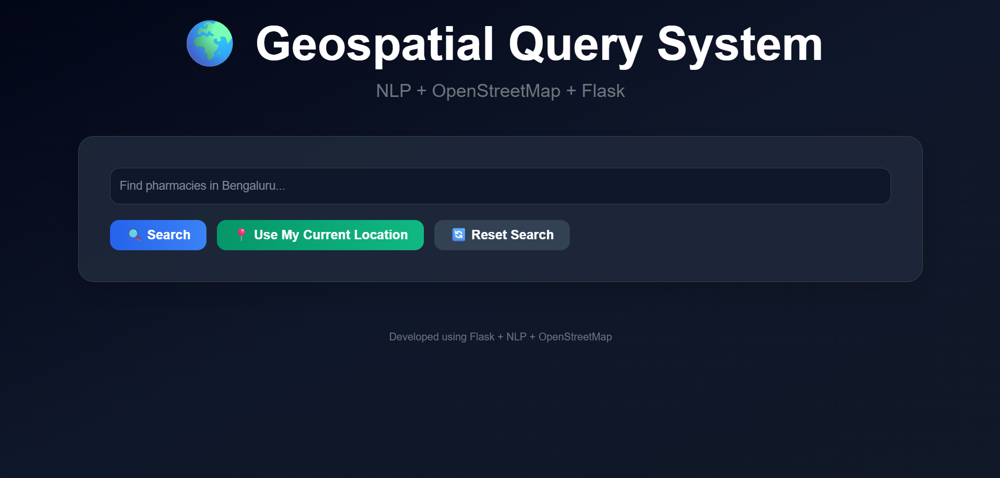
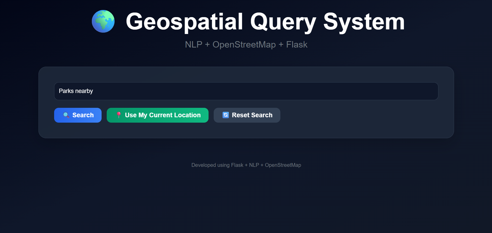
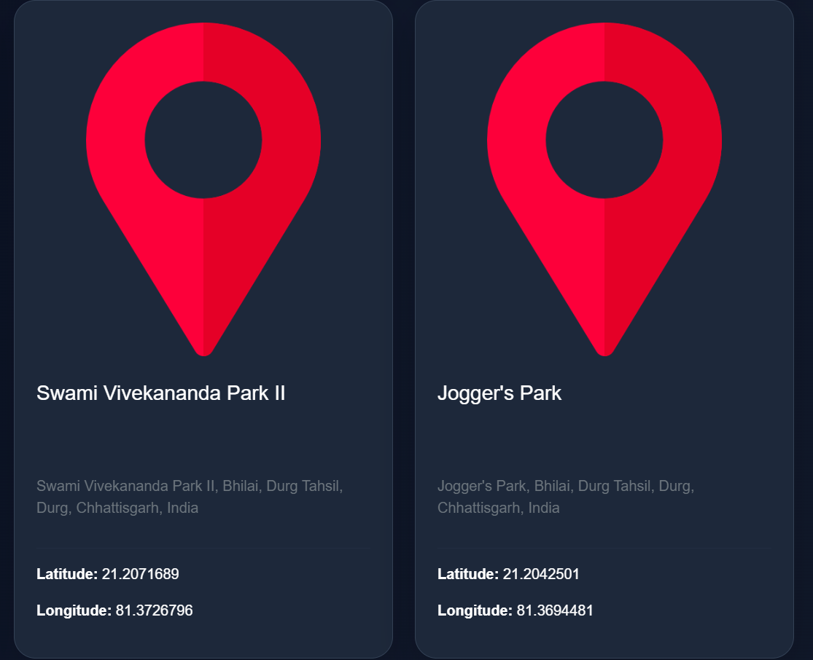

# 🌍 Geospatial Query System

A modern Flask-based geospatial search system that uses NLP and OpenStreetMap to discover nearby locations dynamically.

---

## ✨ Features

- 🧠 NLP-based query extraction
- 📍 Real-time GPS support
- 🗺️ Interactive maps using Folium
- 🏥 Nearby place discovery
- 🎨 Modern responsive UI
- ⚡ Animated search experience
- 🖼️ Dynamic place cards
- 🛡️ Error handling with fallback images

---

## 🛠️ Technologies Used

- Python
- Flask
- OpenStreetMap
- Nominatim
- Folium
- HTML / CSS / JavaScript
- Bootstrap

---

## 🚀 Run Locally

```bash
pip install -r requirements.txt
python app.py
```

---

## 🔎 Example Queries

- Hospitals nearby
- Restaurants in Goa
- Tourist places in Jaipur
- Train stations nearby
- Cafes in Bangalore

---

## 📸 Screenshots

### Homepage UI


### Query Search Demo


### Nearby Places Results


---

## 📂 Project Structure

```bash
modules/
static/
templates/
screenshots/
app.py
requirements.txt
README.md
```

---

## 🧠 Project Workflow

User Query → NLP Processing → Geolocation → Nearby Place Search → Interactive Map Generation → Frontend Display

---

## 📌 Future Improvements

- Voice-based search
- AI-powered recommendations
- Distance filtering
- Better animations and transitions
- Mobile app support